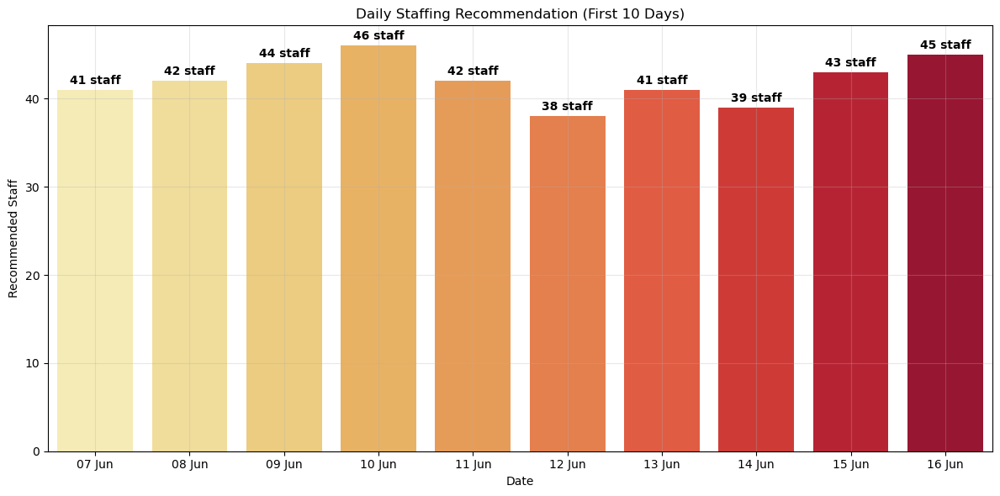
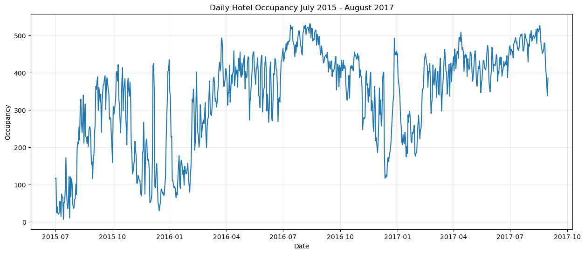
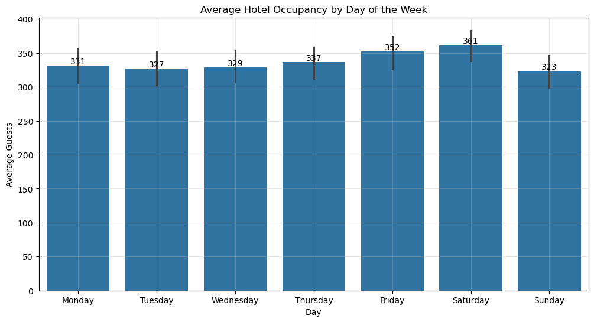
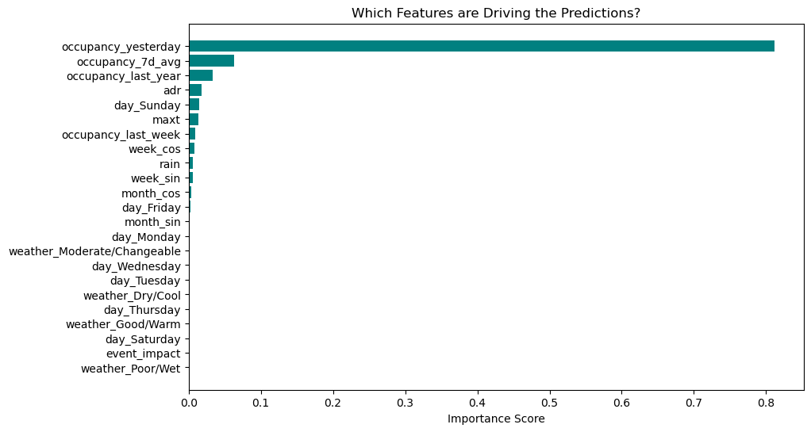
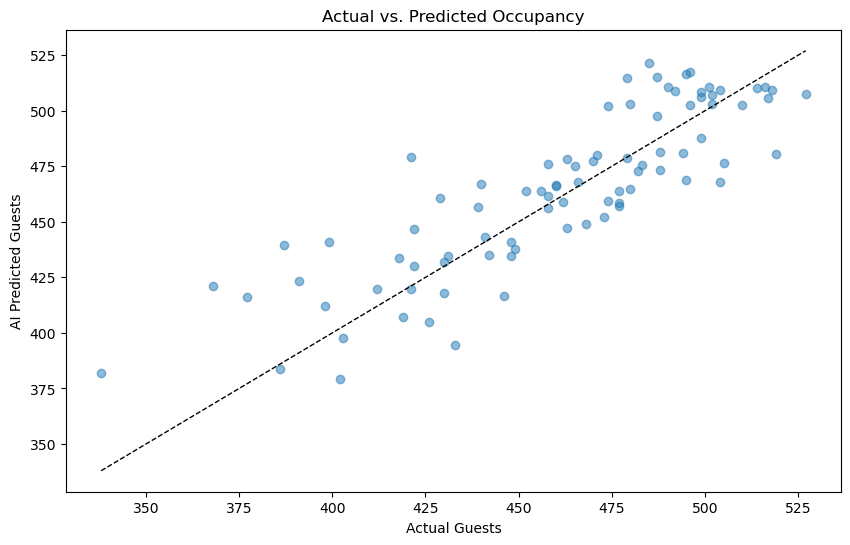

# Hotel Staffing Optimisation using Random Forest Regression

## Overview
This project addresses the operational challenge of hotel overstaffing and understaffing. By building a predictive data pipeline, the system forecasts daily staffing demands for a property in the Glasnevin area. 

The model predicts requirements by combining and aligning historical weather data, localized Dublin events, and past hotel occupancy records. This allows management to optimize shift distribution, reduce payroll waste, and maintain consistent guest service levels.

## Key Analytics & Engineering Steps

### 1. Environmental Data Processing (Met Éireann)
* Sourced and aggregated three years (2015–2017) of historical daily weather logs from Met Éireann.
* Isolated critical variables: rainfall, minimum temperature, and maximum temperature.
* Engineered a categorical feature (`weather_quality`) to map raw metrics into business-friendly conditions: *Good/Warm*, *Dry/Cool*, *Poor/Wet*, and *Moderate/Changeable*.

### 2. Localized Event Integration
* Generated a synthetic dataset simulating major Dublin-area events near Glasnevin from 2015–2017 (AI-assisted), due to the lack of an accessible consolidated public dataset for hyperlocal event history in the target area.
* Normalized date formats to match the weather logs.
* Assigned numerical impact weights to events (`event_impact`): `0` for routine days, `1` for minor disruptions, and `2` for major area draws (e.g., stadium concerts).

### 3. Hotel Guest & Room Occupancy Processing
* Sourced an extensive raw booking dataset (over 119,000 reservation logs) from Kaggle.
* Filtered data to isolate a single city-center property and dropped incomplete records.
* Consolidated adults and children metrics to calculate real, nightly guest volume.
* Developed a **custom date-expansion algorithm** using `pandas.Timedelta`. This logic unpacks single booking ranges (check-in date + length of stay) into discrete nightly rows to calculate active daily on-site occupancy, while factoring out cancellations.

### 4. Pipeline Merging & Temporal Alignment
* Consolidated the transformed weather, event, and occupancy tables on their shared `date` keys.
* Identified and resolved an asynchronous timeline issue across the datasets by truncating the analysis strictly to the overlapping window: **July 1st, 2015 to August 31st, 2017** (resulting in 793 clean, filled, and aligned data points).

### 5. Exploratory Data Analysis (EDA)
* Identified clear seasonal trends, including low-volume winter baselines, localized spikes around Christmas, and sustained high occupancy from April through October.
* Verified weekly occupancy rhythms, showing peak traffic on Fridays and Saturdays, with steady corporate volume on mid-week days.

### 6. Results
The Random Forest model achieved an R² of 71% and RMSE of 16.66 guests on the held-out test set. The most influential features were "occupancy_yesterday", "occupancy_7d_avg" and "occupancy_last_year", based on feature importance rankings.

## Tech Stack & Dependencies
* **Core Language:** Python 3
* **Environment:** Jupyter Notebook (`.ipynb`)
* **Libraries Used:** 
  * `pandas`, `numpy` — Data parsing, cleaning, and table operations
  * `matplotlib`, `seaborn`, `plotly` — Statistical plotting and interactive heatmaps
  * `statsmodels` — Trend and baseline evaluation
  * `scikit-learn` — Model training, train/test splitting, and evaluation metrics

## Data Sources & Attribution
* **Hotel Bookings:** [Hotel Booking Demand dataset](https://www.kaggle.com/datasets/jessemostipak/hotel-booking-demand) on Kaggle, originally published by Antonio, Almeida & Nunes (2019), *"Hotel Booking Demand Datasets,"* Data in Brief, Vol. 22.
* **Weather:** Historical daily weather data from [Met Éireann](https://www.met.ie/climate/available-data/historical-data), Ireland's National Meteorological Service.
* **Dublin Events:** Synthetically generated (AI-assisted) to approximate local event dates and impact levels near Glasnevin, in the absence of a suitable public dataset.

## Repository Structure
* `Staffing.ipynb` — The primary notebook containing data cleaning, merging, EDA, and model testing.
* `DataSets/` — Instructions and links for obtaining the raw source data (see `DataSets/README.md`).
* `Plots/` — Exported visualizations from the EDA and model evaluation.
* `Poster Presentation.pdf` — Presentation slides summarizing the project.

## Next Steps & Operational Improvements
If expanding this prototype for a production environment, future steps include:
1. Migrating code from a monolithic Jupyter Notebook into modular, testable `.py` scripts.
2. Converting the Random Forest model into a live microservice via an API endpoint.
3. Building an interactive supervisor dashboard using Streamlit or PowerBI so hotel managers can view upcoming roster recommendations visually.
